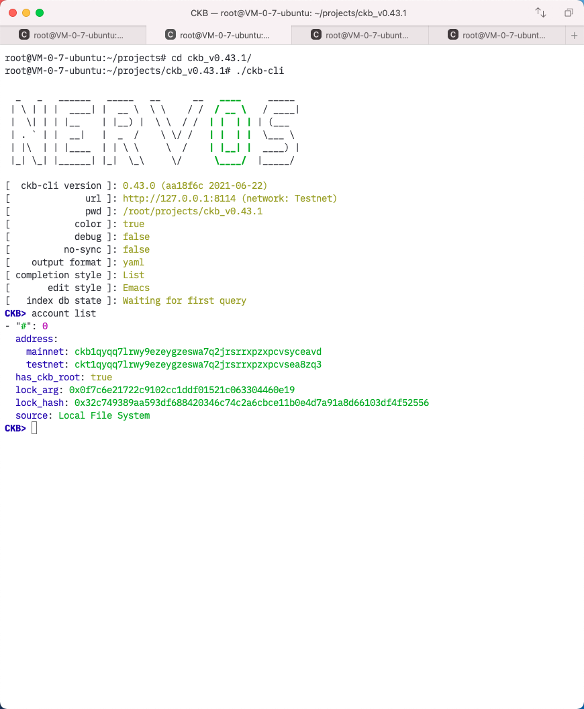
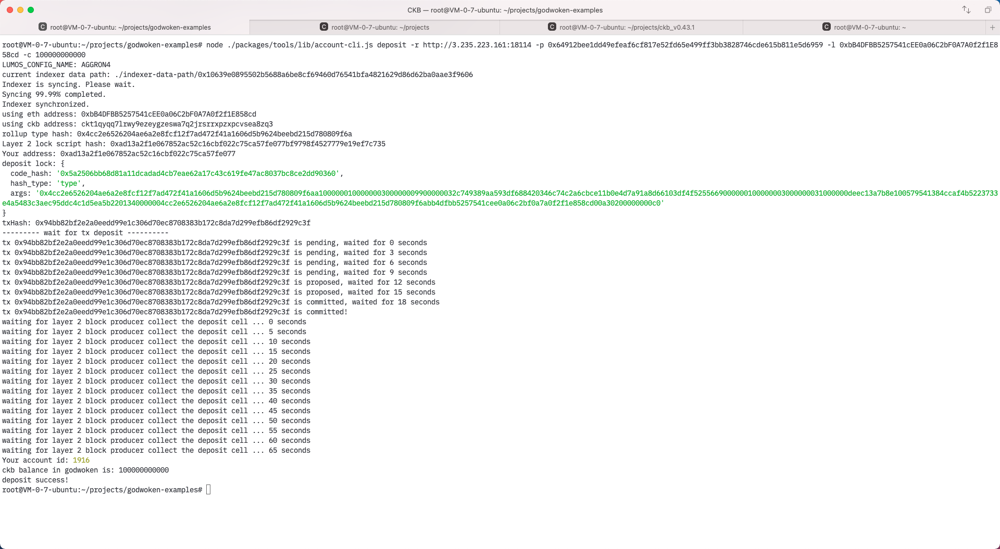

## Task 1. Create a Godwoken Account on the EVM Layer 2 Testnet

1. A screenshot of the accounts you created (account list) in ckb-cli.

2. A link to the Layer 1 address you funded on the Testnet Explorer.

[https://explorer.nervos.org/aggron/transaction/0x3e971f0f1c06a12d4dd9a538cfed3ca3349c55d014a85afa71d4ed70d7a14ba8](https://explorer.nervos.org/aggron/transaction/0x3e971f0f1c06a12d4dd9a538cfed3ca3349c55d014a85afa71d4ed70d7a14ba8)

3. A screenshot of the console output immediately after you have successfully submitted a deposit to Layer 2.

