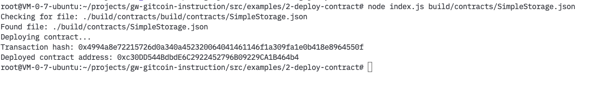

## Task 2 Deploy A Simple Ethereum Smart Contract On Polyjuice

1. A screenshot of the console output immediately after you have successfully deployed a smart contract.

2. The transaction hash from the contract deployment (in text format).

0x4994a8e72215726d0a340a452320064041461146f1a309fa1e0b418e8964550f

3. The deployed contract address from the contract deployment (in text format).

0xc30DD544BdbdE6C2922452796B09229CA1B464b4