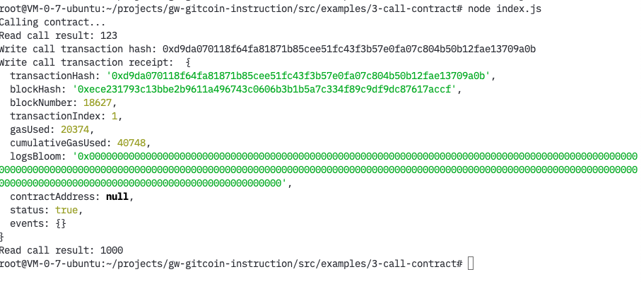

## Task 3 Issue A Smart Contract Call To The Deployed Smart Contract

1. A screenshot of the console output immediately after you have successfully issued a smart contract call.


2. The transaction hash from the console output (in text format).

0xd9da070118f64fa81871b85cee51fc43f3b57e0fa07c804b50b12fae13709a0b

3. The contract address that you called (in text format).

0xc30DD544BdbdE6C2922452796B09229CA1B464b4

4. The ABI for contract you made a call on (in text format).

```
[
    {
      "inputs": [],
      "stateMutability": "payable",
      "type": "constructor"
    },
    {
      "inputs": [
        {
          "internalType": "uint256",
          "name": "x",
          "type": "uint256"
        }
      ],
      "name": "set",
      "outputs": [],
      "stateMutability": "payable",
      "type": "function"
    },
    {
      "inputs": [],
      "name": "get",
      "outputs": [
        {
          "internalType": "uint256",
          "name": "",
          "type": "uint256"
        }
      ],
      "stateMutability": "view",
      "type": "function"
    }
  ]
  ```